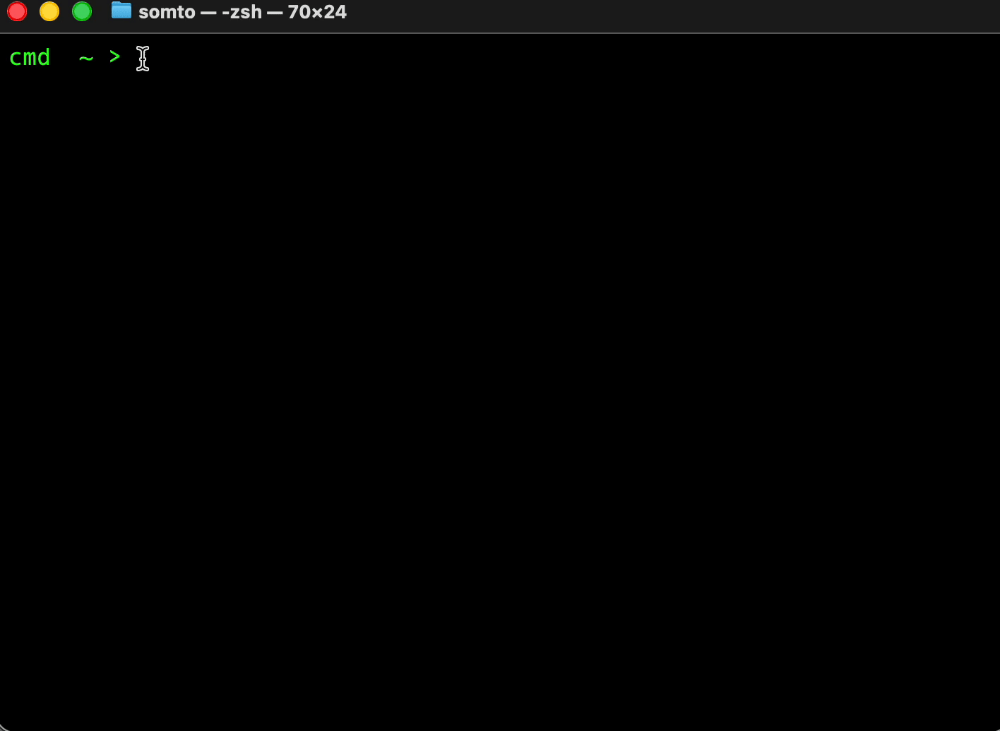

## Trak  
A terminal-first CLI study tracker built for developers and students.

## Why Trak  
Built for people who live in the terminal and want an offline way to track real **focused sessions**.

No accounts • No cloud • No distractions

## Platform Support

Currently supported on:
- macOS 13+

Linux support is planned.

## Installation
Download the latest version from Github Releases:

https://github.com/idafum/Trak/releases

```bash
chmod +x trak
sudo mv trak /usr/local/bin
trak --help
```

## Quick Start

Get up and running in under a minute:

### 1. Initialize Trak  
Set up your local workspace (runs once):

`trak init`

### 2. Create a subject  
Organize sessions by what you're working on:

`trak subject create <subject>`

### 3. Start tracking  
Begin a focused session:

`trak session start <subject>`

### 4. Control your session  

Take a break when life happens:

`trak session pause`

Continue when you're back:

`trak session resume`

### 5. Finish and save the session

`trak session end`

### 6. Finish and discard the session

`trak session end --delete`

### 7. Reporting

Sessions are stored locally and can be reviewed anytime:

`trak report`

## Demo
<p align="center">
  
</p>

## Roadmap
### Trak for macOS

- [ ] Native macOS app powered by Trak-CLI data

